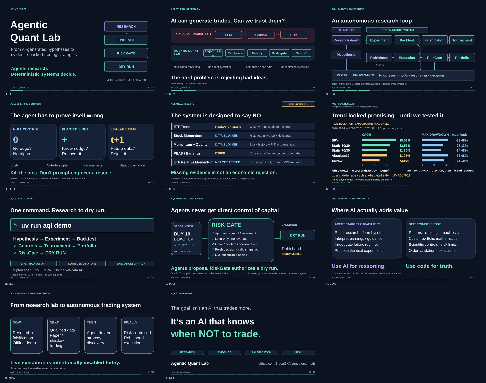
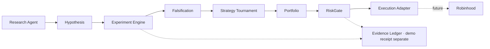

# Agentic Quant Lab

An evidence-first quantitative research lab working toward autonomous strategy discovery: AI agents research and propose hypotheses; deterministic code calculates, backtests, falsifies, compares portfolios, and enforces risk controls. Today's runnable demo uses a **scripted agent and synthetic fixtures**, not a live LLM or evidence of profitable alpha. Real research is documented separately. Live trading is disabled; Robinhood is disconnected.

## Demo

**[Slides — download the PowerPoint](demo/Agentic-Quant-Lab-Demo.pptx)** ·
[PDF / offline fallback](demo/Agentic-Quant-Lab-Demo.pdf) ·
[Editable slide source](demo/slides.md)

**[Presenter Script](demo/presentation-script.md)** — exact spoken English, 11 slides, approximately 6½ minutes including the demo.

**[Demo Runbook](demo/demo-runbook.md)** — preparation, exact commands/clicks, and offline fallbacks.

**Run**

```bash
uv run aql demo
```

Prepare Python 3.12 and run `uv sync --frozen` beforehand. On the prepared machine,
use `uv run --offline --no-sync aql demo` for a network-independent presentation.
Open the generated `demo-output/index.html`. If setup fails, download and open the
[pre-generated local dashboard](demo/assets/offline-demo/index.html); no installation
is needed. **DEMO FIXTURE ≠ REAL RESEARCH.**



### Architecture

```text
Research Agent
      ↓
Hypothesis
      ↓
Backtest + Falsification
      ↓
Strategy Tournament
      ↓
Portfolio
      ↓
RiskGate
      ↓
Execution Adapter
      ↓
Robinhood (future)
```

## What it does

- Agents research hypotheses; today's demo agent is scripted, not an LLM.
- Deterministic code runs experiments and preserves evidence.
- Falsification rejects weak ideas; synthetic scores do not establish alpha.
- A tournament feeds a demo portfolio proposal.
- RiskGate checks the proposal against a supplied demo snapshot.
- Live trading is disabled; execution is dry-run only.

## Current status

| State | Scope |
| --- | --- |
| ✅ | Phase 0 foundation, research harness and demo tournament integrated. |
| ✅ | Fixed-rule ETF trend research and independent stock, PEAD and sector data audits restored. |
| 🚧 | Autonomous strategy discovery and paper trading—not ready. |
| ⏳ | Robinhood integration—future; current stub disabled. |

## Quick Demo

Prerequisites: **Python 3.12 and [uv](https://docs.astral.sh/uv/)**.
From the repository root:

```sh
uv sync
uv run aql demo
```

Open **`demo-output/index.html`**; its companion is **`demo-output/receipt.json`**.
Installation must prepare dependencies and may need network access. The demo
runtime uses committed synthetic inputs, not accounts, cloud services or real-data downloads.

[Five-minute presenter script](docs/demo-script.md) ·
[Research status and provenance](docs/research-status.md)

The complete presentation package is linked above. The earlier
[short HTML overview](docs/demo-slides.html) remains available as an archival
alternative; it is not the 5–7 minute presentation.

<details>
<summary>Demo: offline preparation, seven stages, reproducibility and safety</summary>

### Prepare before disconnecting

Run `uv sync` while the required Python, build tools and packages are available.
This is **not** a promise that a cold install works without those packages.
On a prepared machine, bypass uv's synchronization and all network access:

```sh
uv run --offline --no-sync aql demo
```

If uv's cache is missing but the prepared virtual environment is intact, invoke
the already-installed entry point directly; this also uses no network:

```sh
.venv/bin/aql demo
```

Both commands require the installation to have completed beforehand. PostgreSQL,
SEC contact details, Azure credentials, market-data subscriptions and broker
accounts are unnecessary for the demo.

### What the seven stages show

| CLI stage | What to inspect |
| --- | --- |
| `[1/7]` agent | Deterministic strategy-agent proposals; this is an agent interface, not an LLM call. |
| `[2/7]` experiment | An explicit experiment specification and reproducible input provenance. |
| `[3/7]` backtest | Synthetic monthly valuations, delayed decisions and transaction costs. |
| `[4/7]` controls | Synthetic controls and rejection of future-available information, not proof of market alpha. |
| `[5/7]` tournament | Four demo strategies compared, including a portfolio view rather than just a winning score. |
| `[6/7]` RiskGate | One proposed BUY checked against a supplied demo portfolio snapshot. |
| `[7/7]` dry run + evidence | A simulated execution decision, local dashboard and separate demo receipt. |

The four strategies are **Relative Momentum, Trend, Weak and Null**. All are
synthetic demonstrations; Weak and Null are not quality or PEAD models, and
neither Relative Momentum nor Trend reproduces a completed real-market experiment.
The fictional symbols are `DEMO_UP`, `DEMO_WEAK` and `DEMO_NULL`, using a committed
fixture with seed **20260918**.

Relative Momentum uses **compressed three-period momentum, skipping the latest
period**, not the real sector experiment's **12-1** rule. Fixture prices are
monthly valuations, not exchange fills. The simulation uses a **one-period
delay** and **10 bps one-way cost**. Demo scores, rankings, returns and allocation
illustrations are **not research evidence or evidence of profitable alpha**.
Real research candidates are displayed separately from the demo tournament.

### Files and repeatability

The default dashboard `demo-output/index.html`, receipt `demo-output/receipt.json`
and detailed `demo-output/result.json` are overwritten deterministically for
the same code, fixture and configuration.
To regenerate them explicitly:

```sh
uv run aql demo --reset
```

On a prepared offline machine use `uv run --offline --no-sync aql demo --reset`,
or `.venv/bin/aql demo --reset`. Reset regenerates **owned demo files only**;
it is not a recursive cleanup of unrelated files, a research-data reset or a
Phase 0 ledger operation.

The receipt timestamp is **fixed scenario time**, deliberately repeatable:
it is **not the actual time of an audit event or this invocation**. Demo hashing
reuses the existing ledger utility, but demo receipts remain separate from the
Phase 0 append-only ledger and its observed SEC timestamps. Hashes bind content;
they do not certify source truth, research validity or live execution.

RiskGate's demonstration is limited to a **single proposed BUY against supplied
demo state**. It is not continuous enforcement on a live account, reconciliation
with a broker or a complete multi-order portfolio risk system.
`live_execution.enabled = false` is a hard-fail boundary; the Robinhood adapter
is a **disabled stub**, not a broker connection. A successful dry run is neither
an order placement nor authorization to trade.

</details>

<details>
<summary>Architecture, evidence sidecar and repository layout</summary>



The demo sidecar writes separate local receipts; it does not append to the
Phase 0 evidence ledger. Robinhood remains a future integration.

| Module under `src/agentic_quant_lab/` | Responsibility |
| --- | --- |
| `agents.py` | Deterministic strategy-agent interface; future LLM implementations must obey the same evidence boundaries. |
| `strategies.py` | The four explicitly synthetic strategy rules. |
| `experiment.py` | Run the experiment specification through the existing research engine and summarize fixture results. |
| `tournament.py` | Comparable demo results without ranking real research candidates on synthetic scores. |
| `portfolio.py` | Synthetic portfolio construction and snapshot representation. |
| `risk.py` | RiskGate decisions against explicitly supplied state. |
| `execution.py` | Dry-run execution boundary and disabled Robinhood stub. |
| `demo.py` | Seven-stage orchestration, synthetic controls, deterministic receipt and local HTML rendering. |
| `resources/` | Packaged fixtures and canonical `research_status.json`, usable without a checkout-only research cache. |
| `ledger.py` | Existing canonical hashing/ledger utilities; Phase 0 evidence remains separate. |
| `recorder.py`, `sec.py`, `database.py`, `blob_ledger.py` | Prospective SEC recording, transport and durable ledger/query projection. |

The demo reuses `research.engine.simulate` on synthetic inputs. Historical
acquisition, research results and the demo tournament remain separate; this is
not a live feature store. `docs/` holds research decisions, presenter
guidance and historical operational reports. `migrations/` contains ordered
append-only evidence migrations. `tests/` contains deterministic and explicitly
opt-in integration tests; research-specific tests live in `research/tests/`.
`infra/azure/` contains the deployment runbook and templates.
`.github/workflows/` contains CI and manual recorder automation.
`Dockerfile` retains the pinned, non-root Phase 0 production image.

LLM-backed agents and future Robinhood integration are product directions,
not current capabilities. Any future execution work requires separate authorization,
compliance review, qualified data, broker/account reconciliation and real risk controls;
the demo does not relax the constitution.

</details>

<details>
<summary>Real research: methodology, findings and limitations</summary>

The canonical structured summary is
[`src/agentic_quant_lab/resources/research_status.json`](src/agentic_quant_lab/resources/research_status.json).
The [research-status guide](docs/research-status.md) records source reports, exact
branch heads, integration provenance and reopening gates. Read the reports before
using any historical number; no generated demo score updates these verdicts.

| Research family | Current finding |
| --- | --- |
| Fixed modern ETF Trend | **RESEARCH MORE**, limited to executable-close verification. NAV-proxy results are weak versus static 80/20 or 70/30 de-risking; **no paper/shadow promotion** and no parameter rescue. |
| Stock momentum and momentum + quality | **C. RESEARCH-GRADE STOCK TEST CURRENTLY BLOCKED.** Historical membership, stable security identity, terminal outcomes and accession-level quality vintages remain unqualified; no new alpha backtest. |
| PEAD | Price-based and guidance-text: **LOW-COST DATA REQUIRED**. Consensus-surprise and revision momentum: **BLOCKED**. Overall: **DEFER PEAD**; no qualified event/price join or reported performance. |
| Sector-relative / dual momentum | **EXPLORATORY; RESEARCH MORE; DATA ACQUISITION STILL BLOCKED.** No raw panel acquired, **zero of 18** scenarios run; neither alpha nor an economic rejection. |

Research fixes hypotheses, timing, costs and falsification before inspecting
results. The general harness retains **481 predeclared runs**, not 481 independent
discoveries. It tests delayed availability, missing held returns, changed source
hashes and drifted self-financing costs, with null/planted/leakage controls.
Retrospective splits are pseudo-out-of-sample, not untouched discovery data;
descriptive bootstrap uncertainty does not remove selection bias.

The old 70-stock panel is survivor-selected, academic long portfolios are not
executable ETF holdings, and sleeve blending is not a stock-level quality model.
The modern fixed ETF study covers January 2016–July 2026 and retains all **36**
model/cost/defense scenarios. Its issuer NAV/distribution audit includes split
neutrality and payment-date reinvestment, but NAV remains a valuation proxy,
not verified exchange-close execution. Its weak findings supersede the older
crisis-heavy ETF build-priority recommendation.

The independent sector study freezes actual **12-1** top-three selection and
one same-window BIL-hurdle variant. Missing source bytes stop it before performance;
the successful historical SPY/BIL trend audit cannot validate the unavailable
sector panel. Quality/PEAD data gaps cannot be filled by renaming a toy strategy.
Taxes, actual fills, source vintages, survivorship, revisions and terminal-value
coverage constrain any investment interpretation. No candidate is promoted here.

### Reproduction is separate from the demo

For the general harness follow [`research/README.md`](research/README.md);
for the fixed trend experiment follow
[`research/etf_trend/README.md`](research/etf_trend/README.md).
Their optional dependency preparation starts with:

```sh
uv sync --locked --group research
```

Real-data acquisition is **not part of Quick Demo**. Reproduction requires
authorized, matching raw archival bytes: raw third-party data is not committed,
and a manifest hash is not a substitute for the missing body. Source revisions
must fail verification rather than silently rewrite a result; use a new explicitly
identified vintage for new acquisition attempts. See the individual reports for
commands and unpassed gates, not the synthetic dashboard.

</details>

<details>
<summary>Phase 0 operations: SEC recorder, PostgreSQL, Azure, acceptance and recovery</summary>

These are retained operator instructions, **not demo prerequisites or actions
performed by the demo**. The [historical real SEC acceptance report](docs/sec-acceptance-report.md)
records external acceptance **PASS**; its earlier blockers are superseded only as
described in that report. This documentation integration did **not** rerun SEC,
Azure, live-service acceptance, deployment or recording.

Historical acceptance and activation policy are distinct. The packaged
constitution deliberately still has `phase0.external_acceptance_complete = false`,
`phase0.scheduled_recording_enabled = false` and `live_execution.enabled = false`.
Those flags are untouched. The product now includes offline demo and research
layers alongside the frozen Phase 0 subsystem; it is not a Phase-0-only product.

## Local setup and the one-filing slice

The recorder, unlike the demo, requires Python 3.12, uv, PostgreSQL 16+,
and Linux/POSIX file locking.
Commands below assume the repository is the current directory; use absolute
paths for your durable ledger, migration files, and correction JSON files.

```sh
uv sync --locked --python 3.12
psql "$MIGRATION_DATABASE_URL" -v ON_ERROR_STOP=1 -f "$PWD/migrations/001_evidence.sql"
psql "$MIGRATION_DATABASE_URL" -v ON_ERROR_STOP=1 -f "$PWD/migrations/002_archive_recovery.sql"
```

Apply migrations in numeric order **once**, not on each recorder run.
Existing `001` installations apply only `002`; it permits archive recovery
events without changing prior evidence. Each migration is transactional.
The runtime must use a
separate non-owner, non-superuser login with only `CONNECT` on the database,
`USAGE` on the schema and `SELECT, INSERT` on the evidence tables. A database
administrator must provision that login and its authentication out of band.
For an existing login named `quant_recorder` and a database named `quant_lab`:

```sql
GRANT CONNECT ON DATABASE quant_lab TO quant_recorder;
REVOKE CREATE ON SCHEMA public FROM PUBLIC;
GRANT USAGE ON SCHEMA public TO quant_recorder;
GRANT SELECT, INSERT ON audit_events, discoveries, filings, corrections TO quant_recorder;
GRANT SELECT ON universe_snapshots, reconciliations TO quant_recorder;
```

Do not grant schema/table ownership, role membership in the migration owner,
`CREATE`, `UPDATE`, `DELETE`, `TRUNCATE`, or replication/trigger-disabling
privileges. Triggers additionally reject UPDATE/DELETE/TRUNCATE, including
TRUNCATE CASCADE, even for ordinary owner-issued statements. A superuser or
owner able to drop objects or disable triggers is outside this protection boundary.

Set configuration in your shell or secret manager; `.env` files are not loaded.
Never commit credentials.

| Variable | Purpose |
| --- | --- |
| `DATABASE_URL` | Runtime PostgreSQL DSN; use certificate-verified TLS for remote production databases |
| `SEC_USER_AGENT` | Required application name and real contact email, per SEC fair-access policy |
| `LEDGER_PATH` | Durable JSONL path; defaults to `state/sec.jsonl` for local development only |
| `LEDGER_BACKEND` | `local` (default) or `azure`; Azure never uses the local path as a durability fallback |
| `AZURE_STORAGE_ACCOUNT_URL` | HTTPS Blob account endpoint without credentials/query/path; required for Azure |
| `AZURE_STORAGE_CONTAINER` / `AZURE_LEDGER_PREFIX` | Isolated ledger namespace; defaults `aql-audit-ledger` / `sec` |
| `DATABASE_AUTH` | `password` (existing local behavior) or `azure` (short-lived Entra token) |
| `AZURE_SUBSCRIPTION_ID` | Explicit subscription for local Azure CLI authentication |
| `AZURE_CLIENT_ID` | Explicit user-assigned managed identity in Container Apps |
| `UNIVERSE_CIKS` | Comma-separated CIKs, normalized and snapshotted; required for batch commands |
| `INGEST_CIKS` | Optional separate raw-ingestion scope; defaults to the research universe for a bounded deployment |
| `CATCHUP_START` | Explicit first SEC dissemination-index date to reconcile, `YYYY-MM-DD`; required by `record` |
| `HEARTBEAT_URL` | Optional HTTPS success hook locally; required by scheduled workflow |
| `RECORDER_GIT_SHA` | Optional full code commit SHA; set automatically by the workflow |

```sh
uv run quant-recorder ingest-one \
  https://www.sec.gov/Archives/edgar/data/320193/0000320193-24-000123.txt
uv run quant-recorder verify "$LEDGER_PATH"
# Repeating ingest-one does not fetch again or add duplicate evidence.
uv run quant-recorder record
# Explicitly rescan any historical interval; end must precede today's SEC Eastern date.
uv run quant-recorder catch-up --start 2026-09-08 --end 2026-09-09
# Explicit tertiary recovery for a completed quarter whose daily indexes are unavailable:
uv run quant-recorder recover-quarter --year 2024 --quarter 4
```

Use a complete SEC submission `.txt` URL, not its primary HTML document. The
recorder archives the exact bytes as base64 in the ledger, plus their SHA-256.
HTTP requests identify the caller, are bounded to 32 MiB and 45 seconds, use
at most four attempts, and are paced to at most four requests/second, below the
[SEC's ten-request/second limit](https://www.sec.gov/about/developer-resources).
Coordinate this budget with any other clients sharing the same IP.
Oversized, malformed, blocked, or incomplete responses fail without publishing
eligible content. Large submissions need an explicitly reviewed size-limit
change, not truncation.

## Evidence and time contract

All stored timestamps are timezone-aware UTC:

| Field | Meaning |
| --- | --- |
| `accepted_at` | `<ACCEPTANCE-DATETIME>` from the SEC submission header, converted from America/New_York with DST |
| `first_seen_at` | Our first discovery, durably appended before attempting the content fetch |
| `fetched_at` | When a complete successful content fetch returned |
| `decision_eligible_at` | Exactly `fetched_at`, including filings recovered through catch-up |

SEC acceptance and index filing dates are **not** observation times. Historical
catch-up never pretends the content was available to this system earlier.
Ambiguous/nonexistent local acceptance times fail closed rather than guessing.
The host clock must be synchronized. Failed fetches retain their discovery
timestamp across retries and restarts.
New filing payloads explicitly carry `availability_mode=observed`; legacy
records have the same enforced observed semantics, not inferred availability.
Every new event carries package version, a hash of package source/config files,
optional Git SHA, and a nonsecret recorder configuration with its own hash.
No contact identities, DSNs, heartbeat URLs, or credential hashes are recorded
as provenance. Old evidence is not rewritten to fill missing provenance.

The ledger is authoritative; PostgreSQL is its query projection:

1. Acquire a database advisory lock and, locally, an exclusive ledger file lock.
2. Verify the full hash chain, content hashes, identities, prospective timestamps,
   and checkpoint prerequisites; compare every existing database row and payload.
3. Replay missing durable events and missing materialized rows without modifying
   any existing evidence. Divergence fails closed before repair.
4. Preflight payloads for JSONB representability without writing evidence.
   Append canonical JSON with sequence, event ID, UTC record time, `prev_hash`
   and SHA-256; flush and `fsync` (local) or atomically commit a create-only
   block blob (Azure) before the corresponding database transaction.
5. Insert with conflict handling. `UNIQUE(source, external_id)` prevents
   duplicate filing identities. SEC amendments have their own accession IDs.

A crash after the ledger append but before the database commit is recoverable
on the next run. A partial final line or divergent database fails closed; never
truncate or edit the ledger to make verification pass. Restore a known-good
backup and rebuild into a **new, empty migrated database/schema** with
`uv run quant-recorder replay`. A standalone `verify` checks chain and evidence
semantics without database/network configuration. `uv run quant-recorder reconcile`
detects missing, extra, or differing database evidence **without repairing it**;
`replay` inserts only missing rows after verifying all existing rows match.
Successful recording/catch-up reconciles again before sending any healthy heartbeat.
Offline `verify`, `reconcile`, and `replay` need no SEC contact identity.
An independent heartbeat/backup head can be checked with:
`quant-recorder verify "$LEDGER_PATH" --expected-sequence N --expected-head HASH`.

Corrections are new linked events, not edits or silent replacements:

```sh
uv run quant-recorder correct EVENT_UUID --reason "Explanation" \
  --changes /absolute/path/to/annotation.json
```

The JSON object is an explicit annotation/change proposal; the original filing
and its timestamps stay unchanged. Query `corrections` alongside original
evidence rather than treating annotations as retroactively available facts.
An identical target/reason/changes correction is idempotent.

## Discovery, reconciliation, and universe snapshots

The latest-filings Atom feed is a low-latency hint with only 100 entries, not a
complete history. Each successful `record` also scans daily master indexes
from `CATCHUP_START` through yesterday in SEC Eastern time. Only selected CIKs
are fetched. Daily checkpoints are appended **after all selected filings are
persisted**, scoped to the universe hash, and include the exact index bytes and
hash. Older completed dates are skipped; the latest three completed dates are
rechecked for late index publication. Explicit `catch-up` forces a rescan.
The index header's dissemination date must match the requested day; individual
rows can legitimately have older filing dates. Declared HTTP content lengths
are checked before any response can become reconciliation evidence.

Missing intervals, failed fetches, and changed universes are therefore
recoverable without backdating eligibility. Universe changes append a new
snapshot and trigger reconciliation for the new scope; they never delete
earlier evidence. Pending discoveries remain eligible for retry even if a CIK
is later removed. SEC indexes can be republished; rescan older dates explicitly
if necessary. A 404 on a known weekend/federal holiday is allowed without a
completion checkpoint. SEC also returns 403 for some nonexistent weekend objects:
only on a known closure, a successfully fetched and validated official quarter
directory proving that exact index absent permits skipping it without a checkpoint.
Listed-but-inaccessible indexes, weekday 403s, malformed/unavailable directories,
other unexplained missing indexes, extraordinary closures and failed fetches
fail the run and suppress the success heartbeat.
Independent filings/dates are still attempted after source failures so one
unavailable submission cannot starve the rest of the universe. Ledger or
database write failures, by contrast, abort immediately.
Snapshots include an observed `as_of`, explicit-list screen version, config
hash, and selection reason. Membership is a step function of snapshots in
ledger order; before the first snapshot it is **unknown**, not today's list.
Only listed CIKs are eligible under that snapshot. `INGEST_CIKS` can record a
broader raw scope without granting research eligibility. Checkpoints bind the
ingestion scope independently; expanding it reopens historical reconciliation.

## Azure deployment and durability

See [the Azure runbook](infra/azure/README.md) for reproducible deployment and
real-world acceptance, and [the deployment report](docs/azure-deployment-report.md)
for actual resources, costs, tests and remaining gates. It reuses discovered shared
infrastructure without redeploying RiskPulse applications. PostgreSQL and the Blob namespace are
isolated AQL state. The production container has no build/development tools,
runs as a non-root user, and performs no dependency installation at startup.

The [real SEC acceptance report](docs/sec-acceptance-report.md) records successful
official ingestion, prospective timestamps, duplicate-free reruns, missed-interval
recovery and independent filing-bearing replay. This is manual acceptance only;
the scheduler and live-execution policy remain disabled.

Azure uses managed identity for Blob and PostgreSQL. A separate Entra
migration administrator owns the schema; the recorder has only the evidence
grants described above. `DATABASE_AUTH=azure` requires a password-free DSN
to an Azure PostgreSQL endpoint with `sslmode=verify-full` and a trusted
`sslrootcert`. Local Azure commands use the explicitly selected subscription;
Container Apps uses the explicitly configured runtime identity.

The Blob backend stores one canonical JSONL record per block blob:
`sec/records/00000000000000000001.jsonl`, and so on. Atomic create-if-absent
commits prevent two writers from replacing the same sequence, including
writers attached to different databases. Large SEC records are not constrained
by the legacy append-blob 4 MiB limit. Upload failure, an ambiguous acknowledgement,
gaps, unexpected filenames, or invalid bytes fail closed. A subsequent verified
replay recovers a committed Blob record whose database transaction was missed.
There is no local-file fallback and no mutable head/manifest to reconcile.
All records are re-read and verified before reporting database reconciliation.
As with the local backend, full-chain scans are intentionally Phase 0 scale.

Independent verification and export need neither a database nor SEC contact:

```sh
# Configure LEDGER_BACKEND=azure and the nonsecret Azure endpoint/identity settings.
uv run quant-recorder verify-blob
uv run quant-recorder export-ledger /absolute/backup/sec.jsonl \
  --expected-sequence N --expected-head HASH
uv run quant-recorder verify /absolute/backup/sec.jsonl \
  --expected-sequence N --expected-head HASH
# Point DATABASE_URL at a NEW, empty migrated restore database/schema.
LEDGER_BACKEND=local LEDGER_PATH=/absolute/backup/sec.jsonl uv run quant-recorder replay
LEDGER_BACKEND=local LEDGER_PATH=/absolute/backup/sec.jsonl uv run quant-recorder reconcile
```

Export refuses to overwrite an existing destination. Retain the expected head
independently, not just beside the ledger being checked. Azure storage enables
versioning and soft delete, not irreversible WORM retention.

## Manual execution and success monitoring

**Scheduling remains disabled.** The Azure Job has a `Manual` trigger, the
GitHub recorder workflow has no cron trigger, and the packaged constitution
still prohibits scheduled recording and live execution. A manually dispatched
workflow uses scoped GitHub OIDC, not the operator's Azure CLI login or a
long-lived client secret. CI stays on GitHub-hosted runners with disposable
PostgreSQL and **no production secrets or Azure identity**.

Supply the real `SEC_USER_AGENT` through the job's secret configuration, never
the image, committed parameters, or test CI. Missing contact fails recording
without fabricating evidence. `snapshot`, `verify-blob`, `reconcile`, and
`replay` remain available without it but do not satisfy SEC acceptance.

The recorder emits `event=aql.recorder.completed` only after `record` or
`catch-up` has completed ingestion, durable ledger writes, database commits,
and final reconciliation. Azure Monitor additionally requires
`ledger_backend=azure` and `reconciliation=passed`. Merely starting a process,
a successful maintenance command, or an Azure Job `Succeeded` status is not
an ingestion heartbeat. Failed recording/reconciliation exits nonzero with
fixed credential-free JSON error codes. Provider exception messages and
tracebacks are deliberately not printed.

An optional local `HEARTBEAT_URL` still accepts HTTPS POST JSON containing
`new_filings`, `sequence`, and `hash`. Redirects are refused; only a 2xx
acknowledgement succeeds, and hook failure fails the job without undoing
evidence. Omission is explicit (`heartbeat=disabled`). Azure log alerts provide
the deployment's independent failure/dead-man path without requiring this hook.

Quarterly archive recovery is manual and uses SEC's `full-index` master index.
It records exact index bytes and a distinct `archive_recovery` event only after
the selected content is persisted. It **never** advances daily reconciliation
checkpoints: quarterly filing dates cannot prove daily dissemination coverage.
Eligibility remains observed at the actual fetch, and oversized archives fail
the same bounded-download policy instead of silently truncating.

The JSONL chain is tamper-evident, not tamper-proof: an attacker who can rewrite
the entire chain, or remove a suffix together with the database, can defeat
unanchored verification. Keep independent immutable/off-host backups and retain
head hashes at the heartbeat receiver or in independently retained Azure logs.
Blob versions/soft delete are recoverability aids, not proof against an
administrator rewriting all history. Demonstrate export and replay into a
fresh database before claiming restoration acceptance. GitHub artifacts/cache
are **not** the durable ledger. Phase 0 verifies and loads the full ledger on startup; large-scale
segmentation/rotation is deliberately deferred.

## Validation

```sh
uv run ruff check .
uv run ruff format --check .
uv run pyright
TEST_DATABASE_URL=postgresql:///quant_test uv run pytest -m "not live_sec and not live_azure"
uv build
```

The production image is also built and smoke-tested in CI, without an Azure
identity or production configuration. The opt-in Azure persistence test uses
a generated, isolated `acceptance/<uuid>` Blob prefix and the usual disposable
PostgreSQL schema. It tests real conditional commits, independent export and
idempotent replay, but deliberately creates **no SEC filing evidence**:

```sh
RUN_LIVE_AZURE=1 \
TEST_AZURE_STORAGE_ACCOUNT_URL=https://YOURACCOUNT.blob.core.windows.net \
TEST_AZURE_STORAGE_CONTAINER=aql-audit-acceptance \
TEST_DATABASE_URL=postgresql:///quant_test \
uv run pytest tests/test_live_azure.py -v
```

It requires explicit `AZURE_SUBSCRIPTION_ID`, an authenticated local Azure CLI,
and Blob read/write/delete permission on that isolated test container. Only its generated
test blobs are removed; production `sec/` records are never touched.

Use only an **isolated disposable test database** whose test administrator can
create roles and schemas. Each PostgreSQL test gets a separate schema and
restricted writer role. Without `TEST_DATABASE_URL`, database tests skip;
CI always supplies it. Unit fixtures are explicitly synthetic, not proof of
real SEC connectivity.

The real-filing acceptance gate is opt-in. Historical deployed acceptance is
recorded in [the SEC acceptance report](docs/sec-acceptance-report.md), not newly
established by this guide or the demo. For a separately authorized acceptance
rerun, use your real SEC contact User-Agent, a network allowed by SEC, and the
isolated test database (no production secrets):

```sh
RUN_LIVE_SEC=1 \
TEST_SEC_URL=https://www.sec.gov/Archives/edgar/data/320193/0000320193-24-000123.txt \
TEST_SEC_INDEX_DATE=2024-11-01 \
TEST_DATABASE_URL=postgresql:///quant_test \
uv run pytest -m live_sec -v
```

Tests cover prospective timestamps, duplicate-free reruns, durable first
discovery across failed fetches, ledger-before-database crash recovery,
missed-interval catch-up, failed-run checkpoint behavior, correction history,
ledger tampering/truncation, writer locks and append-only database permissions
and triggers. Live SEC results must not be substituted with a mocked response.
The live tests require both the filing URL and its dissemination-index date;
they verify original bytes/hashes and timestamps, a restart with zero duplicates,
and recovery with latest-feed discovery deliberately omitted. If SEC has retired
that daily index, choose a recent 8-K/10-Q/10-K with an available daily index;
manual quarterly recovery is not a substitute for the daily-catch-up acceptance gate.

To inspect a separately provisioned acceptance recorder after a real run:

```sh
uv run quant-recorder reconcile
uv run quant-recorder verify "$LEDGER_PATH"
psql "$DATABASE_URL" -c \
  'SELECT source, external_id, accepted_at, first_seen_at, fetched_at,
          decision_eligible_at, content_sha256 FROM filings ORDER BY fetched_at DESC LIMIT 5'
psql "$DATABASE_URL" -c \
  'SELECT sequence, kind, prev_hash, record_hash FROM audit_events ORDER BY sequence DESC LIMIT 5'
```

Use a dedicated acceptance heartbeat endpoint. Confirm receipt of the successful
run's chain head, then deliberately stop manual acceptance runs and wait past
the receiver's configured interval plus grace; verify an alert reaches you.
This tests the external dead-man switch, not merely HTTP delivery. Do not send
standalone synthetic successes to a production monitoring endpoint.

## 120-hour review contract

The packaged machine-readable constitution sets a six-hour weekly budget and
a review at 120 total hours. Expected deliverables by that review are:
a reliable prospective recorder, externally monitored ingestion, an independently
recoverable ledger, a point-in-time data contract, an immutable experiment-registry
foundation, validated null/positive/leakage controls, first panel-evidence
implementation, first published-anomaly replication, and an analytic feasibility map.
These are review targets, **not claims of current completion**.

Outside that operational scope: autonomous live trading, production Robinhood
execution, live multi-agent trading, RD-Agent integration, and sophisticated
automated strategy discovery. The local demo dashboard and deterministic agent
interfaces do not provide those capabilities. Compliance status remains
unreviewed/unknown; live execution cannot be enabled before the required policy
reviews and explicit authorization of a future phase. The disabled Robinhood
stub is not a functional broker implementation.

## Synthetic scientific controls (test-only)

`tests/scientific_controls.py` contains immutable, seeded IID linear fixtures and
a toy slope estimator with normal-approximation uncertainty. Tests across a
fixed seed ensemble check a null random score, recovery of a known planted
effect, interval coverage/standard-error calibration, and rejection of deliberately
future-available information. Generator version and seed identify the fixtures.
Run `uv run pytest tests/test_scientific_controls.py`.

This test-only fixture is a control foundation, not market-data or panel-evidence
validation. The separate research harness and product demo do not upgrade it:
passing IID control tests does not establish uncertainty calibration for dependent
market data, and synthetic demo results are not real-anomaly replications.

</details>